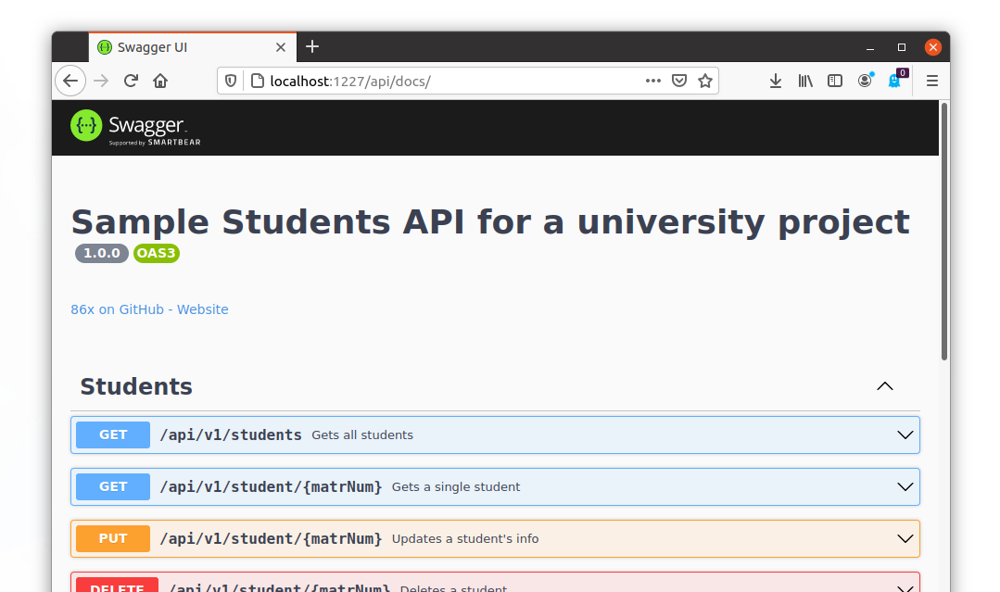

# example-openapi-swagger-jsdoc

## Description
This shows off the capabilities of [swagger-jsdoc](https://www.npmjs.com/package/swagger-jsdoc) and [swagger-ui-express](https://www.npmjs.com/package/swagger-ui-express) when developing an API in Express for node.js. Effectively, an [OpenAPI](https://openapis.org) description will be generated from code comments with the annotation @openapi.

Screenshot of the generated Swagger UI page:



---


## :rocket: Setup
1. Clone this repo to your disk.
```
git clone https://github.com/86x/example-openapi-swagger-jsdoc
```

2. Open a terminal window and install [nodejs](https://nodejs.org/) and [npm](https://www.npmjs.com/).
```
sudo apt install nodejs npm
```

3. Install the required dependencies while inside the project's directory.
```
cd ./example-openapi-swagger-jsdoc
npm install
```

4. Run the project
```
node index.js
```

5. In the terminal you should see "Listening on port 1227". Open a web browser and navigate to /api/docs for the Swagger UI page
```
http://localhost:1227/api/docs
```
or navigate to /api/docs/openapi.json to see the OpenAPI description
```
http://localhost:1227/api/docs/openapi.json
```

6. (Optional:) If the installation didn't work properly and/or the project won't run, try to manually install the dependencies from within the project's directory.
```
npm init -y
npm i express@4.17.1 joi@17.4.0 swagger-jsdoc@7.0.0-rc.6 swagger-ui-express@4.1.6
```

---


## Customize the port used by the app
By default, port 1227 is used. To change it, you can set the environment variable `PORT` to the port you would like to use. Open a terminal window and enter the following command, where `1228` should be replaced by the port you desire.
```
export PORT=1228
```


---


## Context
This is part of a university project where I had the chance to take a look at [OpenAPI](https://openapis.org) and some of it's alternatives.


---


## Used npm packages in this project (Thanks!)
- [express](https://www.npmjs.com/package/express) (framework for node.js applications)
- [joi](https://www.npmjs.com/package/joi) (for input validation)
- [swagger-jsdoc](https://www.npmjs.com/package/swagger-jsdoc) (to generate an OpenAPI description from code comments with the annotation @openapi)
- [swagger-ui-express](https://www.npmjs.com/package/swagger-ui-express) (to generate a Swagger UI page from the OpenAPI description provided by swagger-jsdoc)
- (Optionally:) [nodemon](https://www.npmjs.com/package/nodemon) (This isn't required to run the project, however, it is useful in development.)
